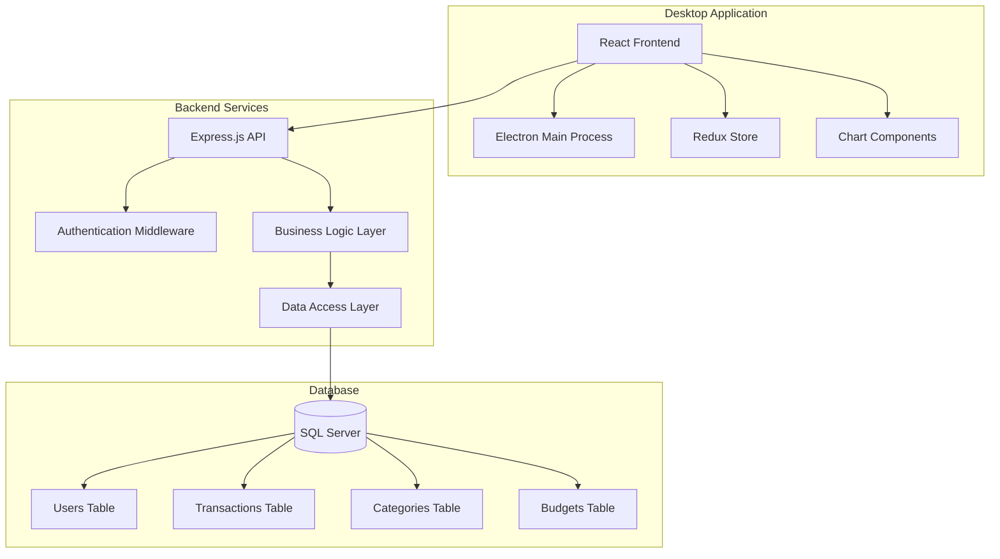

# Design Document

## Overview

Ứng dụng Quản lý Tài chính Cá nhân là một desktop application được xây dựng với React frontend và SQL Server backend. Hệ thống sử dụng kiến trúc client-server với RESTful API, tập trung vào giao diện người dùng đẹp mắt và trải nghiệm người dùng mượt mà.

### Technology Stack
- **Frontend:** React 18+ với TypeScript
- **UI Framework:** Material-UI (MUI) hoặc Ant Design cho giao diện đẹp
- **State Management:** Redux Toolkit + RTK Query
- **Charts:** Chart.js hoặc Recharts cho biểu đồ
- **Backend:** Node.js với Express.js
- **Database:** SQL Server 2019+
- **ORM:** Sequelize hoặc TypeORM
- **Authentication:** JWT tokens
- **Desktop:** Electron để đóng gói thành desktop app

## Architecture

### System Architecture



### Database Schema

```sql
-- Users table
CREATE TABLE Users (
    UserID INT IDENTITY(1,1) PRIMARY KEY,
    Email NVARCHAR(255) UNIQUE NOT NULL,
    PasswordHash NVARCHAR(255) NOT NULL,
    FullName NVARCHAR(255) NOT NULL,
    PhoneNumber NVARCHAR(20),
    CreatedAt DATETIME2 DEFAULT GETDATE(),
    UpdatedAt DATETIME2 DEFAULT GETDATE(),
    IsActive BIT DEFAULT 1
);

-- Categories table
CREATE TABLE Categories (
    CategoryID INT IDENTITY(1,1) PRIMARY KEY,
    UserID INT FOREIGN KEY REFERENCES Users(UserID),
    CategoryName NVARCHAR(100) NOT NULL,
    CategoryType NVARCHAR(20) CHECK (CategoryType IN ('Income', 'Expense')),
    IconName NVARCHAR(50),
    ColorCode NVARCHAR(7), -- Hex color code
    CreatedAt DATETIME2 DEFAULT GETDATE(),
    IsActive BIT DEFAULT 1
);

-- Transactions table
CREATE TABLE Transactions (
    TransactionID INT IDENTITY(1,1) PRIMARY KEY,
    UserID INT FOREIGN KEY REFERENCES Users(UserID),
    CategoryID INT FOREIGN KEY REFERENCES Categories(CategoryID),
    Amount DECIMAL(15,2) NOT NULL,
    TransactionType NVARCHAR(20) CHECK (TransactionType IN ('Income', 'Expense')),
    TransactionDate DATE NOT NULL,
    Description NVARCHAR(500),
    CreatedAt DATETIME2 DEFAULT GETDATE(),
    UpdatedAt DATETIME2 DEFAULT GETDATE()
);

-- Budgets table
CREATE TABLE Budgets (
    BudgetID INT IDENTITY(1,1) PRIMARY KEY,
    UserID INT FOREIGN KEY REFERENCES Users(UserID),
    CategoryID INT FOREIGN KEY REFERENCES Categories(CategoryID),
    BudgetAmount DECIMAL(15,2) NOT NULL,
    BudgetMonth INT NOT NULL, -- 1-12
    BudgetYear INT NOT NULL,
    WarningThreshold DECIMAL(5,2) DEFAULT 70.00, -- Percentage
    CreatedAt DATETIME2 DEFAULT GETDATE(),
    UpdatedAt DATETIME2 DEFAULT GETDATE()
);

-- Settings table
CREATE TABLE UserSettings (
    SettingID INT IDENTITY(1,1) PRIMARY KEY,
    UserID INT FOREIGN KEY REFERENCES Users(UserID),
    SettingKey NVARCHAR(100) NOT NULL,
    SettingValue NVARCHAR(500),
    CreatedAt DATETIME2 DEFAULT GETDATE(),
    UpdatedAt DATETIME2 DEFAULT GETDATE()
);

-- Notifications table
CREATE TABLE Notifications (
    NotificationID INT IDENTITY(1,1) PRIMARY KEY,
    UserID INT FOREIGN KEY REFERENCES Users(UserID),
    NotificationType NVARCHAR(50),
    Title NVARCHAR(200),
    Message NVARCHAR(1000),
    IsRead BIT DEFAULT 0,
    CreatedAt DATETIME2 DEFAULT GETDATE()
);
```

## Components and Interfaces

### Frontend Component Structure

```
src/
├── components/
│   ├── common/
│   │   ├── Layout/
│   │   │   ├── Sidebar.tsx
│   │   │   ├── Header.tsx
│   │   │   └── MainLayout.tsx
│   │   ├── Forms/
│   │   │   ├── TransactionForm.tsx
│   │   │   ├── CategoryForm.tsx
│   │   │   └── BudgetForm.tsx
│   │   └── Charts/
│   │       ├── PieChart.tsx
│   │       ├── BarChart.tsx
│   │       └── LineChart.tsx
│   ├── pages/
│   │   ├── Auth/
│   │   │   ├── LoginPage.tsx
│   │   │   └── RegisterPage.tsx
│   │   ├── Dashboard/
│   │   │   └── DashboardPage.tsx
│   │   ├── Transactions/
│   │   │   ├── TransactionList.tsx
│   │   │   └── AddTransaction.tsx
│   │   ├── Statistics/
│   │   │   └── StatisticsPage.tsx
│   │   ├── Budget/
│   │   │   └── BudgetPage.tsx
│   │   └── Settings/
│   │       └── SettingsPage.tsx
│   └── hooks/
│       ├── useAuth.ts
│       ├── useTransactions.ts
│       └── useBudgets.ts
├── store/
│   ├── slices/
│   │   ├── authSlice.ts
│   │   ├── transactionSlice.ts
│   │   ├── categorySlice.ts
│   │   └── budgetSlice.ts
│   └── api/
│       └── apiSlice.ts
├── types/
│   ├── User.ts
│   ├── Transaction.ts
│   ├── Category.ts
│   └── Budget.ts
└── utils/
    ├── formatters.ts
    ├── validators.ts
    └── constants.ts
```

### API Endpoints Design

```typescript
// Authentication endpoints
POST /api/auth/login
POST /api/auth/register
POST /api/auth/logout
GET /api/auth/me

// Transaction endpoints
GET /api/transactions?page=1&limit=10&startDate=&endDate=&categoryId=
POST /api/transactions
PUT /api/transactions/:id
DELETE /api/transactions/:id
GET /api/transactions/summary?month=&year=

// Category endpoints
GET /api/categories
POST /api/categories
PUT /api/categories/:id
DELETE /api/categories/:id

// Budget endpoints
GET /api/budgets?month=&year=
POST /api/budgets
PUT /api/budgets/:id
DELETE /api/budgets/:id
GET /api/budgets/progress?month=&year=

// Statistics endpoints
GET /api/statistics/overview?startDate=&endDate=
GET /api/statistics/by-category?startDate=&endDate=
GET /api/statistics/trends?period=monthly|yearly

// Settings endpoints
GET /api/settings
PUT /api/settings
POST /api/backup
POST /api/restore
```

### TypeScript Interfaces

```typescript
// User interface
interface User {
  id: number;
  email: string;
  fullName: string;
  phoneNumber?: string;
  createdAt: string;
  isActive: boolean;
}

// Transaction interface
interface Transaction {
  id: number;
  userId: number;
  categoryId: number;
  amount: number;
  transactionType: 'Income' | 'Expense';
  transactionDate: string;
  description?: string;
  category?: Category;
  createdAt: string;
  updatedAt: string;
}

// Category interface
interface Category {
  id: number;
  userId: number;
  categoryName: string;
  categoryType: 'Income' | 'Expense';
  iconName: string;
  colorCode: string;
  isActive: boolean;
}

// Budget interface
interface Budget {
  id: number;
  userId: number;
  categoryId: number;
  budgetAmount: number;
  budgetMonth: number;
  budgetYear: number;
  warningThreshold: number;
  spent?: number;
  percentage?: number;
  category?: Category;
}

// Statistics interface
interface StatisticsSummary {
  totalIncome: number;
  totalExpense: number;
  netSavings: number;
  transactionCount: number;
  topCategories: CategorySummary[];
}

interface CategorySummary {
  categoryId: number;
  categoryName: string;
  totalAmount: number;
  percentage: number;
  colorCode: string;
}
```

## Data Models

### Redux Store Structure

```typescript
interface RootState {
  auth: {
    user: User | null;
    token: string | null;
    isAuthenticated: boolean;
    loading: boolean;
  };
  transactions: {
    items: Transaction[];
    loading: boolean;
    pagination: {
      page: number;
      limit: number;
      total: number;
    };
    filters: {
      startDate?: string;
      endDate?: string;
      categoryId?: number;
    };
  };
  categories: {
    items: Category[];
    loading: boolean;
  };
  budgets: {
    items: Budget[];
    loading: boolean;
    currentMonth: number;
    currentYear: number;
  };
  statistics: {
    summary: StatisticsSummary | null;
    chartData: any;
    loading: boolean;
  };
}
```

### Database Connection Configuration

```typescript
// Database configuration
const dbConfig = {
  server: 'TIEUNHATBACH\\TIEUNHATBACH',
  database: 'PersonalFinanceDB',
  user: 'sa',
  password: '123456',
  options: {
    encrypt: false,
    trustServerCertificate: true,
    enableArithAbort: true,
  },
  pool: {
    max: 10,
    min: 0,
    idleTimeoutMillis: 30000,
  },
};
```

## Error Handling

### Frontend Error Handling

```typescript
// Error handling middleware for Redux
const errorMiddleware: Middleware = (store) => (next) => (action) => {
  if (action.type.endsWith('/rejected')) {
    // Handle API errors
    const error = action.payload;
    if (error?.status === 401) {
      // Redirect to login
      store.dispatch(logout());
    } else if (error?.status >= 500) {
      // Show server error message
      showNotification('Lỗi server, vui lòng thử lại sau', 'error');
    }
  }
  return next(action);
};

// Error boundary component
class ErrorBoundary extends React.Component {
  constructor(props) {
    super(props);
    this.state = { hasError: false };
  }

  static getDerivedStateFromError(error) {
    return { hasError: true };
  }

  componentDidCatch(error, errorInfo) {
    console.error('Error caught by boundary:', error, errorInfo);
  }

  render() {
    if (this.state.hasError) {
      return <ErrorFallback />;
    }
    return this.props.children;
  }
}
```

### Backend Error Handling

```typescript
// Global error handler middleware
const errorHandler = (err: Error, req: Request, res: Response, next: NextFunction) => {
  console.error(err.stack);

  if (err.name === 'ValidationError') {
    return res.status(400).json({
      success: false,
      message: 'Dữ liệu không hợp lệ',
      errors: err.message,
    });
  }

  if (err.name === 'UnauthorizedError') {
    return res.status(401).json({
      success: false,
      message: 'Không có quyền truy cập',
    });
  }

  res.status(500).json({
    success: false,
    message: 'Lỗi server nội bộ',
  });
};
```

## Testing Strategy

### Frontend Testing

```typescript
// Component testing with React Testing Library
describe('TransactionForm', () => {
  test('should submit form with valid data', async () => {
    render(<TransactionForm />);
    
    fireEvent.change(screen.getByLabelText('Số tiền'), {
      target: { value: '100000' }
    });
    
    fireEvent.click(screen.getByText('Lưu'));
    
    await waitFor(() => {
      expect(mockSubmit).toHaveBeenCalledWith({
        amount: 100000,
        // ... other fields
      });
    });
  });
});

// Redux testing
describe('transactionSlice', () => {
  test('should handle addTransaction.fulfilled', () => {
    const initialState = { items: [], loading: false };
    const action = addTransaction.fulfilled(mockTransaction, '', {});
    
    const newState = transactionSlice.reducer(initialState, action);
    
    expect(newState.items).toContain(mockTransaction);
    expect(newState.loading).toBe(false);
  });
});
```

### Backend Testing

```typescript
// API endpoint testing
describe('POST /api/transactions', () => {
  test('should create new transaction', async () => {
    const transactionData = {
      amount: 100000,
      categoryId: 1,
      transactionType: 'Expense',
      transactionDate: '2024-01-15',
      description: 'Test transaction'
    };

    const response = await request(app)
      .post('/api/transactions')
      .set('Authorization', `Bearer ${authToken}`)
      .send(transactionData)
      .expect(201);

    expect(response.body.success).toBe(true);
    expect(response.body.data.amount).toBe(100000);
  });
});
```

## UI/UX Design Specifications

### Color Palette

```css
:root {
  /* Primary Colors */
  --primary-blue: #3498db;
  --primary-dark: #2c3e50;
  --primary-light: #ecf0f1;
  
  /* Secondary Colors */
  --success-green: #27ae60;
  --warning-orange: #f39c12;
  --danger-red: #e74c3c;
  --info-blue: #3498db;
  
  /* Neutral Colors */
  --gray-100: #f8f9fa;
  --gray-200: #e9ecef;
  --gray-300: #dee2e6;
  --gray-400: #ced4da;
  --gray-500: #adb5bd;
  --gray-600: #6c757d;
  --gray-700: #495057;
  --gray-800: #343a40;
  --gray-900: #212529;
  
  /* Background */
  --bg-primary: #ffffff;
  --bg-secondary: #f8f9fa;
  --bg-sidebar: #34495e;
}
```

### Typography

```css
/* Font System */
.font-primary {
  font-family: 'Segoe UI', Tahoma, Geneva, Verdana, sans-serif;
}

.text-xs { font-size: 0.75rem; }
.text-sm { font-size: 0.875rem; }
.text-base { font-size: 1rem; }
.text-lg { font-size: 1.125rem; }
.text-xl { font-size: 1.25rem; }
.text-2xl { font-size: 1.5rem; }
.text-3xl { font-size: 1.875rem; }
```

### Component Styling Guidelines

```css
/* Button Styles */
.btn {
  padding: 12px 24px;
  border-radius: 8px;
  font-weight: 600;
  transition: all 0.2s ease;
  cursor: pointer;
  border: none;
}

.btn-primary {
  background: var(--primary-blue);
  color: white;
}

.btn-primary:hover {
  background: #2980b9;
  transform: translateY(-1px);
  box-shadow: 0 4px 12px rgba(52, 152, 219, 0.3);
}

/* Card Styles */
.card {
  background: white;
  border-radius: 12px;
  box-shadow: 0 2px 8px rgba(0, 0, 0, 0.1);
  padding: 24px;
  transition: box-shadow 0.2s ease;
}

.card:hover {
  box-shadow: 0 4px 16px rgba(0, 0, 0, 0.15);
}

/* Form Styles */
.form-input {
  width: 100%;
  padding: 12px 16px;
  border: 2px solid var(--gray-300);
  border-radius: 8px;
  font-size: 14px;
  transition: border-color 0.2s ease;
}

.form-input:focus {
  outline: none;
  border-color: var(--primary-blue);
  box-shadow: 0 0 0 3px rgba(52, 152, 219, 0.1);
}
```

### Responsive Design

```css
/* Breakpoints */
@media (max-width: 768px) {
  .sidebar {
    transform: translateX(-100%);
    position: fixed;
    z-index: 1000;
  }
  
  .sidebar.open {
    transform: translateX(0);
  }
  
  .main-content {
    margin-left: 0;
  }
}

@media (max-width: 1024px) {
  .stats-grid {
    grid-template-columns: 1fr 1fr;
  }
}

@media (max-width: 640px) {
  .stats-grid {
    grid-template-columns: 1fr;
  }
}
```

## Performance Optimization

### Frontend Optimization

1. **Code Splitting**: Sử dụng React.lazy() và Suspense cho lazy loading
2. **Memoization**: Sử dụng React.memo, useMemo, useCallback
3. **Virtual Scrolling**: Cho danh sách giao dịch dài
4. **Image Optimization**: Lazy loading và WebP format
5. **Bundle Optimization**: Tree shaking và code splitting

### Backend Optimization

1. **Database Indexing**: Index trên các cột thường query
2. **Query Optimization**: Sử dụng stored procedures cho query phức tạp
3. **Caching**: Redis cache cho dữ liệu thường xuyên truy cập
4. **Connection Pooling**: Quản lý connection pool hiệu quả
5. **Pagination**: Implement pagination cho tất cả list endpoints

### Database Indexes

```sql
-- Indexes for better performance
CREATE INDEX IX_Transactions_UserID_Date ON Transactions(UserID, TransactionDate DESC);
CREATE INDEX IX_Transactions_CategoryID ON Transactions(CategoryID);
CREATE INDEX IX_Categories_UserID_Type ON Categories(UserID, CategoryType);
CREATE INDEX IX_Budgets_UserID_Month_Year ON Budgets(UserID, BudgetMonth, BudgetYear);
```

## Security Considerations

### Authentication & Authorization

1. **JWT Tokens**: Sử dụng JWT với refresh token mechanism
2. **Password Hashing**: Bcrypt với salt rounds >= 12
3. **Rate Limiting**: Giới hạn số request per IP
4. **Input Validation**: Validate tất cả input từ client
5. **SQL Injection Prevention**: Sử dụng parameterized queries

### Data Protection

1. **HTTPS**: Bắt buộc HTTPS cho tất cả communication
2. **Data Encryption**: Encrypt sensitive data trong database
3. **Session Management**: Secure session handling
4. **CORS**: Cấu hình CORS properly
5. **Error Handling**: Không expose sensitive information trong error messages